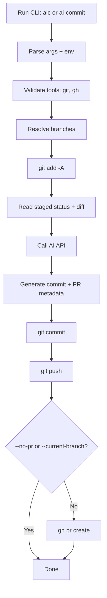

# ai-commit

`ai-commit` is a Bun CLI that:

1. Creates/switches to a branch
2. Stages all tracked and untracked changes
3. Uses AI SDK (chat-completions) or OpenAI Responses API to generate commit + PR summary
4. Commits, pushes, and opens a PR using `gh`

## How It Works



## Requirements

- [Bun](https://bun.com)
- `git`
- `gh` (GitHub CLI) for PR creation
- OpenAI-compatible API credentials

## Install (project development)

```bash
bun install
```

## Install (npm package)

```bash
# run once without installing globally
npx @juniyadi/ai-commit --help

# install globally
npm i -g @juniyadi/ai-commit
aic --help
```

## Run in development

```bash
bun run index.ts --branch feat/my-change
```

## Run as linked command (local)

```bash
bun link
ai-commit --branch feat/my-change
aic --branch feat/my-change
```

## CLI usage

`aic` and `ai-commit` are equivalent:

```bash
aic --branch <name> [options]
# or
ai-commit --current-branch [options]
```

Required:

- `--branch <name>` branch to create/switch and push, or
- `--current-branch` commit/push current branch and skip PR creation

Options:

- `--base <branch>` base branch for PR (default: remote HEAD, fallback current branch)
- `--model <model>` model id (default: `gpt-4o-mini`)
- `--api-key <key>` API key (or env vars)
- `--base-url <url>` OpenAI-compatible API base URL
- `--provider-name <name>` provider label used by AI SDK
- `--api-mode <mode>` `chat` or `responses` (default: `chat`)
- `--responses-path <path>` responses API path (default: `/responses`)
- `--remote <name>` git remote name (default: `origin`)
- `--no-pr` skip PR creation
- `--dry-run` only generate AI metadata

## Planned optional feature: `--skill`

`--skill` is planned as an optional command family to install/update/remove skill markdown files.
This section is the base usage/spec before implementation.

### Goal

- Manage reusable AI-agent skills in either repository scope or user scope.
- Keep skill format generic so it works for Codex, Claude, or other agents.

### Planned command shape

```bash
# install
aic --skill install --file <path/to/skill.md> --scope <repo|user> [--agent <codex|claude|generic>] [--name <skill-name>] [--force]

# update
aic --skill update --file <path/to/skill.md> --scope <repo|user> [--agent <codex|claude|generic>] [--name <skill-name>] [--force]

# remove
aic --skill remove --name <skill-name> --scope <repo|user> [--agent <codex|claude|generic>]
```

### Planned scope resolution

- `--scope repo`: install inside current repository.
- `--scope user`: install in user-level skill directory.

Default target directories:

- `codex` + `repo`: `.codex/skills/`
- `codex` + `user`: `~/.codex/skills/`
- `claude` + `repo`: `.claude/skills/`
- `claude` + `user`: `~/.claude/skills/`
- `generic` + `repo`: `.skills/`
- `generic` + `user`: `~/.skills/`

### Base skill markdown format (agent-agnostic)

```markdown
---
name: conventional-commit-writer
description: Generate clear conventional commit messages from git diff.
version: 1.0.0
agent: generic
---

# conventional-commit-writer

## Use when
- You need a commit message from staged changes.

## Inputs
- `git diff --cached`
- `git status --short`

## Rules
- Use Conventional Commits.
- Keep subject <= 72 characters.
- Mention breaking changes explicitly.

## Output
- Single commit message with optional body.
```

### Planned behavior notes

- `install` fails if target exists, unless `--force` is set.
- `update` fails if target does not exist, unless `--force` is set (create).
- `remove` deletes target skill markdown from resolved directory.
- `--name` overrides filename derived from markdown `name`.
- Validate markdown has required fields: `name`, `description`.

## Environment variables

- `OPENAI_API_KEY` or `AI_COMMIT_API_KEY`
- `OPENAI_BASE_URL` or `OPENAI_API_BASE_URL` or `AI_COMMIT_BASE_URL` or `AI_COMMIT_API_URL`
- `OPENAI_MODEL` or `AI_COMMIT_MODEL`
- `AI_COMMIT_PROVIDER_NAME` (optional)
- `AI_COMMIT_API_MODE` or `OPENAI_API_MODE` (`chat` or `responses`)
- `AI_COMMIT_USE_RESPONSES_API` or `OPENAI_USE_RESPONSES_API` (`true`/`false`)
- `AI_COMMIT_RESPONSES_PATH` or `OPENAI_RESPONSES_PATH` (default: `/responses`)
- `AI_COMMIT_MOCK_METADATA_JSON` (optional, local testing without API calls)

CLI args override environment variables.

## Build binaries (macOS + Linux)

```bash
bun run build:local
./dist/ai-commit --branch feat/my-change

# build all targets
bun run build:all
bun run build:mac-arm64
bun run build:mac-amd64
bun run build:linux-amd64
bun run build:linux-arm64
```

Output binaries are written to `dist/`:

- `ai-commit-macos-arm64`
- `ai-commit-macos-amd64`
- `ai-commit-linux-arm64`
- `ai-commit-linux-amd64`

## GitHub Release from tag

This repo includes a release workflow at `.github/workflows/release.yml`.

When you push a tag like `v1.0.0`, GitHub Actions will:

1. Run builds for:
   - Linux AMD64
   - Linux ARM64
   - macOS AMD64
   - macOS ARM64
2. Use Node.js `20` and Bun in the workflow.
3. Upload all binaries to the GitHub Release for that tag.
4. Upload `checksums.txt` (SHA-256 for all release binaries).

Tag and push example:

```bash
git tag v1.0.0
git push origin v1.0.0
```
